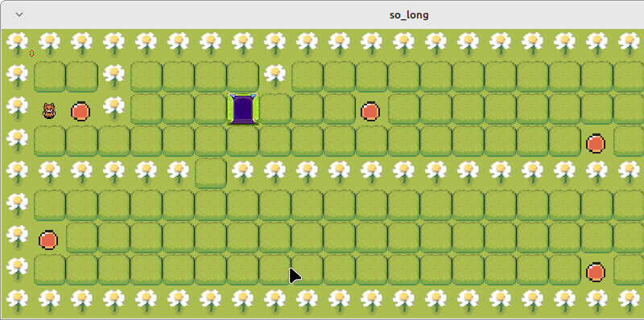

---

## Project Description

**so_long** is a simple 2D game where the player must navigate through a map, collect all items, and reach the exit. The game is built using the **MinilibX** graphics library and includes basic sprite rendering and movement mechanics.

Key Concepts:
- **2D Rendering**: The game uses a grid-based map with each tile representing an element (player, wall, collectible, or exit).
- **Player Controls**: The player moves using keyboard input to explore the map and complete the objective.
- **MinilibX**: A minimal graphical library used to handle window creation, image drawing, and event management.

---

## Requirements for Linux

Before running the project, ensure you have the following dependencies installed:
```bash
sudo apt-get install gcc
sudo apt-get install make
sudo apt-get install xorg
sudo apt-get install libxext-dev
sudo apt-get install libbsd-dev
sudo apt-get install libx11-dev
```

These libraries are necessary for compiling and running the game on a Linux system.

---

## Cloning the Repository

To clone the repository and compile the game, use the following command:
```bash
git clone git@github.com:Leined18/so_long.git
cd so_long
make
```

---

## How to Play the Game

### Option 1: Direct Run
You can immediately play the game by cloning the repository and running the default map:
```bash
git clone git@github.com:Leined18/so_long.git && cd so_long && make && ./so_long assets/maps/map1.ber
```

This will start the game using the provided `map1.ber` file.

### Option 2: Custom Map
Alternatively, you can specify a different map to play with:
```bash
make run MAP=<map_name>
```
Replace `<map_name>` with the name of the `.ber` map file you wish to load.

### Option 3: Bonus Mode
If you want to run the game with the bonus features enabled, use:
```bash
make run_bonus MAP=<map_name>
```
This command compiles and runs the game with any extra features implemented in the bonus part of the project.

---

## Notes
- Ensure that your map files are in the correct format and placed in the `assets/maps` directory.
- The game will only run properly if the provided map follows the correct structure (walls, collectibles, player start, and exit).
